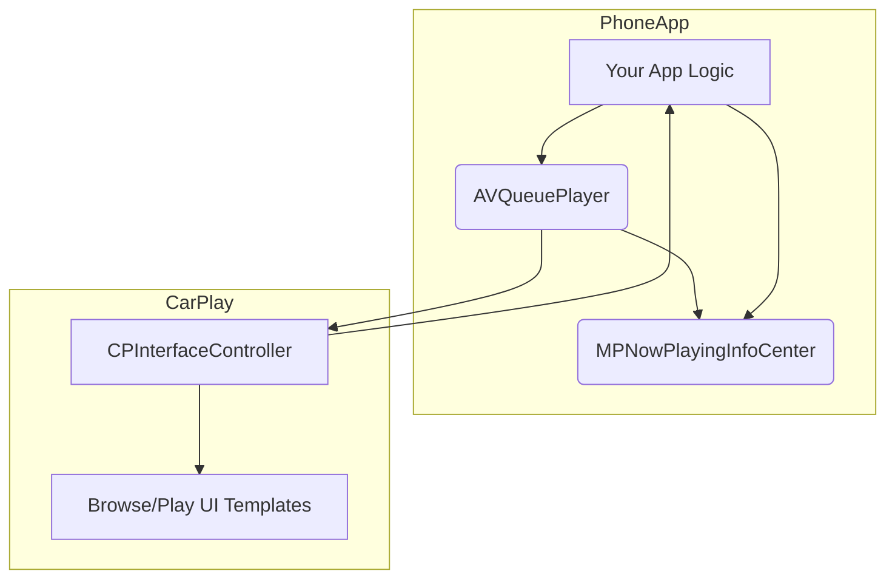
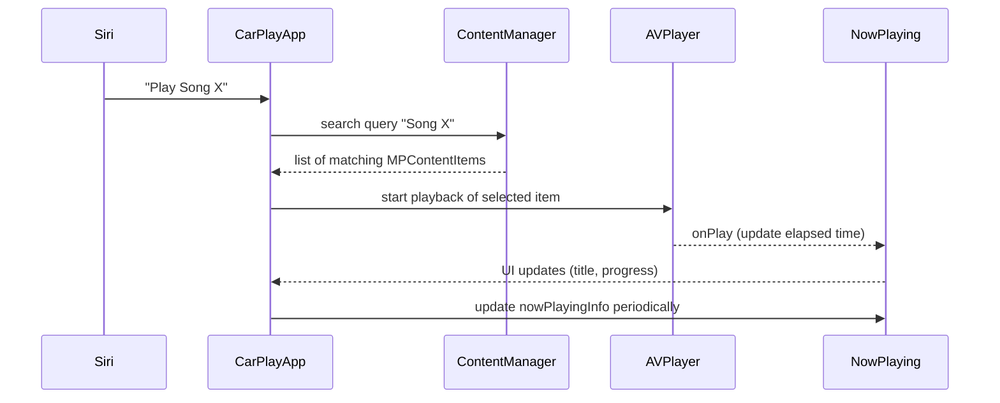

# CarPlay Media App Implementation (Spotify-Level)  

**Executive Summary:** Building a robust CarPlay media app requires following Apple’s CarPlay guidelines and MediaPlayer/AVFoundation frameworks. The app must run a background audio service, expose a browsable media catalog to CarPlay via `MPPlayableContentManager`, and handle playback with `AVPlayer`/`AVQueuePlayer`. Key components include setting up the **CarPlay framework** in your app, configuring **entitlements and Info.plist** (background modes, CarPlay support), and implementing the CarPlay **templates** (`CPTabBarTemplate`, etc.) and **Media Content Data Source** (`MPPlayableContentDataSource`) to serve content to the car. You must update now-playing metadata via `MPNowPlayingInfoCenter`, manage playback progress and queue, and support voice commands (Siri) by responding to search queries. Always configure the **AVAudioSession** for background playback and ducking. Test thoroughly with the CarPlay Simulator and real hardware. Below is an in-depth guide with production-ready Swift code examples, configurations, RN bridging tips, timelines, tables, and diagrams.

## CarPlay Architecture and Framework Components  
- **CarPlay Entitlement:** Enable CarPlay support in your project’s **Signing & Capabilities** (check “CarPlay”). No special entitlements file needed beyond this toggle.  
- **Background Modes:** In **Info.plist**, add `UIBackgroundModes` with `audio`, `external-accessory`, and (for wireless CarPlay) `bluetooth-peripheral`. These allow background audio and external accessory communication.  
- **CarPlay Scene Delegate:** In iOS 14+, implement `CPTemplateApplicationSceneDelegate`. For example, in your `SceneDelegate.swift`:  
   ```swift
   class SceneDelegate: UIResponder, UIWindowSceneDelegate, CPTemplateApplicationSceneDelegate {
       var window: UIWindow?

       func templateApplicationScene(_ templateApplicationScene: CPTemplateApplicationScene,
                                     didConnectCarInterfaceController interfaceController: CPInterfaceController,
                                     to window: CPWindow) {
           interfaceController.delegate = self
           let rootTemplate = // your app's root tab bar template
           interfaceController.setRootTemplate(rootTemplate, animated: true)
       }
   }
   ```
- **Playlists & Templates:** CarPlay UI is driven by templates (audio, list, grid). Your app populates `CPTabBarTemplate` or `CPTabBarController`, then pushes `CPListTemplate` or `CPCarouselTemplate` for content. For a music app, typically use a tab bar with an “Audio” tab.  


*Architecture: Your app’s player and now-playing center interact with the CarPlay interface controller and templates.*

## Exposing Media Catalog (MPPlayableContentDataSource)  
Implement `MPPlayableContentDataSource` to provide the media hierarchy (albums, playlists, tracks) to CarPlay and Siri. Set it on `MPPlayableContentManager.shared()`:  
```swift
MPPlayableContentManager.shared().dataSource = self
MPPlayableContentManager.shared().delegate = self
```
Then implement required methods. For example:  
```swift
class CarPlayContentManager: NSObject, MPPlayableContentDataSource, MPPlayableContentDelegate {
    // Example in-memory data
    let albums = [ 
      Album(id: "album1", title: "Album 1", tracks: [...]),
      Album(id: "album2", title: "Album 2", tracks: [...])
    ]
    
    // Root level: list all albums
    func numberOfChildItems(at indexPath: IndexPath?) -> Int {
        return albums.count
    }
    
    func contentItem(at indexPath: IndexPath) -> MPContentItem? {
        if indexPath.count == 1 {
            // Return an album as a browsable item
            let album = albums[indexPath[0]]
            let item = MPContentItem(identifier: album.id, title: album.title)
            item.isPlayable = false
            item.isCollection = true
            return item
        } else if indexPath.count == 2 {
            // Return a track
            let album = albums[indexPath[0]]
            let track = album.tracks[indexPath[1]]
            let item = MPContentItem(identifier: track.id, title: track.title)
            item.isPlayable = true
            item.isCollection = false
            // Provide a reference (URL) for playback
            item.playbackProgress = 0
            item.isPlaying = false
            item.representativeIdentifier = album.id // (optional metadata)
            return item
        }
        return nil
    }
    
    // Asynchronously load data (e.g., from network)
    func beginLoadingChildItems(at indexPath: IndexPath?, completionHandler: @escaping ([MPContentItem]) -> Void) {
        // For simplicity, immediately return items
        var children: [MPContentItem] = []
        if indexPath == nil {
            for i in 0..<albums.count {
                children.append(contentItem(at: IndexPath(index: i))!)
            }
        } else if indexPath!.count == 1 {
            let album = albums[indexPath![0]]
            for j in 0..<album.tracks.count {
                children.append(contentItem(at: IndexPath(index: indexPath![0], index: j))!)
            }
        }
        completionHandler(children)
    }
}
```
**Notes:**  
- Use `MPContentItem` to describe items; set `isPlayable` and `isCollection` appropriately.  
- The data source can load data from a server or cache, then call `completionHandler`.  
- CarPlay will display these items in its UI.  
- **MPPlayableContentDelegate:** Implement methods like `playableContentManager(_:didUpdate:)` if needed to refresh the UI after changes.

## Playback with AVPlayer/AVQueuePlayer  
Use `AVPlayer` or `AVQueuePlayer` to play audio streams. For queueing multiple tracks:  
```swift
var player = AVQueuePlayer()
func playTrack(_ track: Track) {
    let playerItem = AVPlayerItem(url: URL(string: track.streamURL)!)
    player.replaceCurrentItem(with: playerItem)
    player.play()
}
func enqueueTracks(_ tracks: [Track]) {
    player.removeAllItems()
    for track in tracks {
        let item = AVPlayerItem(url: URL(string: track.streamURL)!)
        player.insert(item, after: nil)
    }
    player.play()
}
```
- **Background Playback:** Configure `AVAudioSession`:  
  ```swift
  try AVAudioSession.sharedInstance().setCategory(.playback, mode: .default, options: [.allowAirPlay, .duckOthers])
  try AVAudioSession.sharedInstance().setActive(true)
  ```
  This allows background audio and automatic handling of mixing/ducking.
- **Now Playing Info:** Update via `MPNowPlayingInfoCenter` whenever playback starts or changes:  
  ```swift
  var nowPlayingInfo: [String: Any] = [
      MPMediaItemPropertyTitle: currentTrack.title,
      MPMediaItemPropertyArtist: currentTrack.artist,
      MPMediaItemPropertyPlaybackDuration: currentTrack.duration,
      MPNowPlayingInfoPropertyElapsedPlaybackTime: player.currentTime().seconds,
      MPNowPlayingInfoPropertyPlaybackRate: player.rate
  ]
  if let image = currentTrack.artworkImage {
      nowPlayingInfo[MPMediaItemPropertyArtwork] = MPMediaItemArtwork(boundsSize: image.size) { _ in image }
  }
  MPNowPlayingInfoCenter.default().nowPlayingInfo = nowPlayingInfo
  ```
  Update `ElapsedPlaybackTime` periodically (e.g. via a timer or `TimeObserver`) so CarPlay’s progress bar stays in sync.

## Progress and Queue Management  
- CarPlay’s Now Playing screen uses `MPNowPlayingInfoCenter.nowPlayingInfo` keys. Update `MPNowPlayingInfoPropertyElapsedPlaybackTime` in real-time (use `player.addPeriodicTimeObserver`).  
- Enable skip/forward commands with `MPRemoteCommandCenter`:  
  ```swift
  let commandCenter = MPRemoteCommandCenter.shared()
  commandCenter.nextTrackCommand.addTarget { _ in 
      self.player.advanceToNextItem()
      return .success
  }
  commandCenter.pauseCommand.addTarget { _ in 
      self.player.pause()
      return .success
  }
  commandCenter.playCommand.addTarget { _ in 
      self.player.play()
      return .success
  }
  ```
- **Automatic Queue:** Use `AVQueuePlayer` to pre-load the next track. When an item finishes, it automatically dequeues the next. Listen to `.AVPlayerItemDidPlayToEndTime` to advance UI state.

## Search / Siri Handling  
- Siri queries are routed through the same `MPPlayableContentDataSource`: when a user says “Play [song name] in MyApp,” iOS will perform a content search. Implement the optional `beginLoadingChildItems(at:completionHandler:)` to handle the special search index path. For example, if `indexPath == []` and your app provided an MPContentItem with `.shouldPlayNext`, the system may query `contentItem(at:)`.  
- You can also implement `MPPlayableContentDelegate.playableContentManager(_:contextFor:)` to filter queries.  
- Ensure your data source responds quickly; consider using `MPContentItem.isSearch` or `MPContentItem.isQueue` properties for search results.

## Error Handling and Offline Fallback  
- **Stream Validation:** Before playing, you may prefetch or check if the URL is reachable. If a track fails, skip to next and update UI with an error message (e.g., using `MPRemoteCommandCenter` events or by sending an alert to the main app).  
- **Empty Catalog:** If no media available, provide sample or offline tracks (e.g., “Demo Song”) so that CarPlay always has something to display. CarPlay will show an empty list if content is missing, which is a bad experience.  
- **Offline Mode:** Cache last-synced playlists or allow the user to download favorites. If network is unavailable, still serve cached items via the data source.  
- **Timeouts:** Use `URLSessionConfiguration` with reasonable timeouts for API calls (e.g., 10–15 seconds). Fail gracefully if content loading is slow (show a “No Network” notice or skip loading).

## Artwork Caching and Networking  
- **Artwork URIs:** Provide high-resolution artwork images to `MPNowPlayingInfoCenter` as shown above. These images may be fetched by CarPlay for display. Cache them locally (e.g. with `URLCache` or a library like Kingfisher) to avoid re-downloading on each track change.  
- **Networking:** Use `URLSession` or a library like Alamofire for API calls. Example with timeout:  
  ```swift
  let config = URLSessionConfiguration.default
  config.timeoutIntervalForRequest = 15
  let session = URLSession(configuration: config)
  ```
- Ensure all network calls are off the main thread. Use completion handlers to supply data to `MPPlayableContentDataSource`’s `beginLoadingChildItems`.

## Audio Session and Focus  
- By setting `.duckOthers`, your audio will smoothly reduce volume when a navigation prompt or phone call occurs. Handle interruptions:  
  ```swift
  NotificationCenter.default.addObserver(self, selector: #selector(audioInterrupted),
                                         name: AVAudioSession.interruptionNotification, object: nil)
  @objc func audioInterrupted(_ notification: Notification) {
      // Pause or resume based on interruption type
  }
  ```
- **Bluetooth/Route Changes:** Register for `AVAudioSession.routeChangeNotification`. If headphones unplug, pause playback:  
  ```swift
  NotificationCenter.default.addObserver(self, selector: #selector(routeChanged),
                                         name: AVAudioSession.routeChangeNotification, object: nil)
  @objc func routeChanged(_ notif: Notification) {
      // If old route was headphones, pause player
  }
  ```

## CarPlay UI Templates and Limitations  
- **Audio App Templates:** Use `CPTabBarTemplate` with at least an `CPListTemplate` for browsing tracks. Your CarPlay storyboard (or code) should include one tab bar with “Audio”.  
- **No Custom UI:** You cannot draw custom views. All UI is via provided templates. You supply data; CarPlay renders list, buttons, etc.  
- **Large Lists:** For long lists, CarPlay paginates automatically. Provide the correct item count in `MPPlayableContentDataSource`.  
- **Commands:** Provide metadata so CarPlay shows track info (artist, album, title). Use `MPContentItem.subtitle` or `representativeIdentifier` for extra text if needed.

## Testing with Simulator and Real Hardware  
- **CarPlay Simulator:** In Xcode’s Debug menu, select *Simulate External Display > CarPlay*. This opens the CarPlay simulator UI. Connect it to your app by enabling CarPlay in the Scheme Run configuration (Options tab).  
- **Workflow:** Run your app on a device; the CarPlay UI should appear in the simulator. Verify browsing, playback, and Siri search.  
- **Real Vehicles/Head Units:** Test on a CarPlay-compatible stereo. Connect via USB (or wirelessly) and ensure your app appears under *Audio*. Test all flows: browse to play, controls, voice commands, disconnect/reconnect.  
- **Logging:** Use `os_log` or console prints to debug CarPlay callbacks (e.g. `templateApplicationScene(_:didConnectCarInterfaceController:)`).  

## App Store and Certification Checklist  
1. **Entitlements:** Ensure CarPlay is enabled in Capabilities.  
2. **Background Modes:** Confirm `audio` is listed under **Background Modes**.  
3. **Info.plist:**  
   - Include `UISupportedExternalAccessoryProtocols` if using external accessories.  
   - (No special key for CarPlay itself, but ensure your app targets iOS 14+ for Scenes.)  
4. **App Store Submission:** Declare CarPlay support in the App Metadata (in App Store Connect, under “General > Game Center / App Services”). Upload a privacy policy if streaming from the internet.  
5. **Apple Review:** The app must not distract (no complex UI, only core audio features). Follow the [CarPlay App Programming Guide](https://developer.apple.com/carplay/) rules. For example, do not present large text or require user typing.  
6. **Testing:** Include CarPlay testing in your QA cycle; mention CarPlay support in release notes if applicable.

## React Native Bridge Example  
React Native doesn’t natively support CarPlay, but you can use a library like [react-native-carplay](https://github.com/birkir/react-native-carplay) or write a custom native module. Here’s a minimal example using a custom bridge in Swift:  

```swift
// CarPlayBridge.swift
@objc(CarPlayBridge)
class CarPlayBridge: NSObject {
    @objc func play() {
        // Access shared player instance
        CarPlayAudioManager.shared.player.play()
    }
    @objc func pause() {
        CarPlayAudioManager.shared.player.pause()
    }
    @objc func setNowPlaying(_ info: NSDictionary) {
        // info might include title/artist/duration
        var nowPlaying: [String: Any] = [:]
        if let title = info["title"] as? String {
            nowPlaying[MPMediaItemPropertyTitle] = title
        }
        if let artist = info["artist"] as? String {
            nowPlaying[MPMediaItemPropertyArtist] = artist
        }
        // Set now playing info
        MPNowPlayingInfoCenter.default().nowPlayingInfo = nowPlaying
    }
}
```
And register it in `CarPlayBridge.m` with RCT_EXPORT:  
```objc
#import <React/RCTBridgeModule.h>
@interface RCT_EXTERN_MODULE(CarPlayBridge, NSObject)
RCT_EXTERN_METHOD(play)
RCT_EXTERN_METHOD(pause)
RCT_EXTERN_METHOD(setNowPlaying:(NSDictionary *)info)
@end
```
On the JS side:  
```js
import { NativeModules } from 'react-native';
const { CarPlayBridge } = NativeModules;

function playTrack(track) {
  CarPlayBridge.setNowPlaying({ title: track.title, artist: track.artist });
  CarPlayBridge.play();
}
```
This illustrates sending commands and metadata from React Native to the native CarPlay manager.

## Comparison of Implementation Options  

| Aspect                       | Native CarPlay APIs (Swift)                             | Third-Party/RN Wrappers (e.g. react-native-carplay)      |
|------------------------------|---------------------------------------------------------|----------------------------------------------------------|
| Ease of Use                  | Full control; steeper learning curve                    | Easier integration for RN; potential limitations         |
| CarPlay Feature Support      | Complete (all templates, Siri, latest updates)          | Limited by library capabilities; may lag behind iOS SDK  |
| UI Development               | Code-driven templates (Storyboard for CarPlay scenes)   | Define via library APIs (e.g. JS config for templates)   |
| Performance                  | Native speed, minimal overhead                          | Slight overhead for bridging, but usually acceptable     |
| Updates/Maintenance          | Depends on app dev; must update for new iOS versions    | Depends on maintainer; may delay support                 |
| Example Code                 | (See sections above)                                    | (Use provided interfaces or this bridge example)        |

## Rollout Timeline / Checklist  
1. **Project Setup (Week 1):** Enable CarPlay capabilities, configure Info.plist and background modes.  
2. **Content Data Source (Week 2):** Implement `MPPlayableContentDataSource` for root and children. Test basic browsing in CarPlay Simulator.  
3. **Playback Engine (Week 3):** Integrate `AVPlayer` and handle audio session (background, ducking). Play sample tracks from the data source. Update Now Playing info.  
4. **Metadata & Controls (Week 4):** Populate `MPNowPlayingInfoCenter` and `MPRemoteCommandCenter`. Ensure CarPlay shows title/artist/artwork and handles play/pause/skip.  
5. **Search/Siri (Week 5):** Enhance the content data source to handle search queries. Test Siri voice commands to play specific songs.  
6. **Error Handling & Caching (Week 6):** Add offline fallback items, handle network errors/timeouts gracefully, cache artwork and data.  
7. **UI Polishing (Week 7):** Build CarPlay templates (tab bar, lists, now playing). Add representative icons and polish.  
8. **React Native Bridging (Week 8):** If using RN, implement native modules (as above) or integrate a library. Ensure RN UI syncs with CarPlay controls.  
9. **Testing (Week 9):** Thorough testing on CarPlay simulator and real head units. Verify compliance with Apple guidelines.  
10. **App Store Prep (Week 10):** Finalize App Store metadata (mention CarPlay support), ensure compliance (e.g. no in-app typing), increase version code.  
11. **Submission & Monitor:** Submit to App Store, monitor for any CarPlay-specific review issues.


*Sequence: User (via Siri/voice) requests a song; the app searches its content source, the player starts, and the now-playing info is updated on the CarPlay display.*

**Sources:** Official Apple CarPlay and MediaPlayer documentation, CarPlay Programming Guide, and WWDC sessions have been used to compile this guide. The examples follow Apple’s recommended APIs (`MPPlayableContentManager`, `AVPlayer`, `MPNowPlayingInfoCenter`, etc.). 

