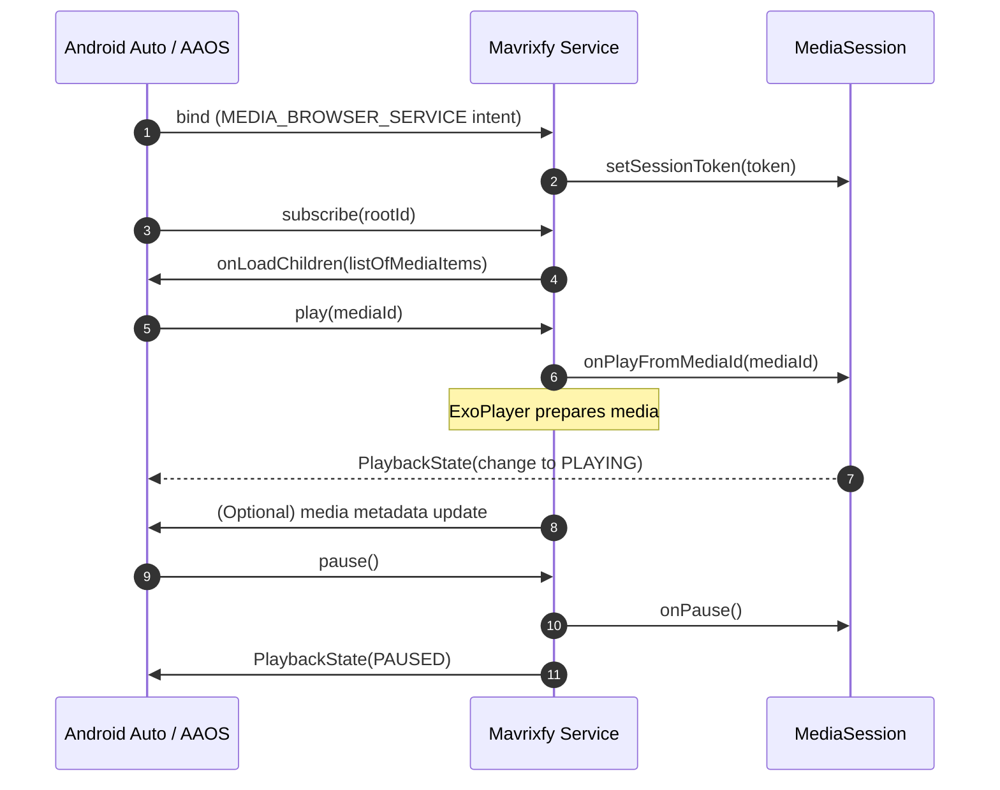

# Integrating Android Auto Support into Mavrixfy: Implementation & PRD

**Executive Summary:** Mavrixfy is an audio streaming app (assumed using ExoPlayer) targeting modern Android versions. To support Android Auto and Android Automotive OS (AAOS), we must implement a standard media-browser service architecture with a `MediaSession`, expose media content via a `MediaBrowserServiceCompat` (or the newer `MediaLibraryService`), and follow Google’s car app guidelines. This entails adding manifest entries (media service declaration and Auto app metadata), handling audio focus and media playback lifecycles, and ensuring the service runs in foreground with a proper MediaStyle notification. We will use ExoPlayer for playback, wire it to the `MediaSession` (via `MediaSessionConnector` or callbacks), and optimize buffering/caching (using Media3 Preload APIs and ExoPlayer caching) to minimize latency. Rigorous testing (Auto Desktop Head Unit emulator, real devices, Media Controller Test app) will cover connectivity, error cases, and compliance with Android Auto’s distracted driving requirements. Below is a detailed plan, PRD, testing/QA checklist, optimization recommendations, sample manifest/service code, API compatibility tables, and architecture diagrams.

## Implementation Plan

1. **Assume App Architecture:** Mavrixfy uses [ExoPlayer](https://developer.android.com/training/media/mediaplayer) for audio playback. We will integrate the AndroidX **Media3** library for modern APIs (MediaLibraryService/MediaSession) but also ensure backward compatibility via `MediaBrowserServiceCompat`. We'll target Android 6.0+ (API 23+), with support for Android Auto (Android 5.0+ devices) and up-to-date Automotive (Android 10+). Media types are audio (songs, podcasts). For network playback, we assume HTTP streaming; local playback is similar but simpler.

2. **Implement MediaBrowserService:** Create a service (e.g. `MediaPlaybackService`) extending `MediaLibraryService` (Media3) or `MediaBrowserServiceCompat` for legacy clients. In `onCreate()`, build the playback pipeline:
   ```kotlin
   override fun onCreate() {
       super.onCreate()
       // 1. Create ExoPlayer instance
       val player = ExoPlayer.Builder(this).build()
       // 2. Create MediaLibrarySession with callback
       mediaSession = MediaLibrarySession.Builder(this, player, sessionCallback).build()
       // 3. Set session token for clients
       // (For MediaBrowserServiceCompat: MediaSessionCompat session + setSessionToken)
   }
   ```
   - **MediaSession:** Use `MediaSessionCompat` (support v4) or Media3 `MediaSession` via `MediaSessionConnector`. In either case, set session flags (`FLAG_HANDLES_MEDIA_BUTTONS`, `FLAG_HANDLES_TRANSPORT_CONTROLS`) and an initial `PlaybackState` with at least `ACTION_PLAY`. Register callbacks to handle controls.

3. **Handle Client Connections:** Override `onGetRoot()` and `onLoadChildren()`:
   - **onGetRoot():** Return a non-null `BrowserRoot`, e.g. `new BrowserRoot(MY_MEDIA_ROOT_ID, null)`. If user is not authorized (e.g. not logged in), return an “empty” root to deny browsing. Optionally implement package validation for security. Example:
     ```java
     @Override
     public BrowserRoot onGetRoot(String clientPackageName, int clientUid, Bundle rootHints) {
         if (allowBrowsing(clientPackageName)) {
             return new BrowserRoot(MY_MEDIA_ROOT_ID, null);
         } else {
             return new BrowserRoot(MY_EMPTY_MEDIA_ROOT_ID, null);
         }
     }
     ```
   - **onLoadChildren():** Supply media items (songs, albums, playlists) under the given parent ID. For example:
     ```kotlin
     override fun onLoadChildren(
         parentId: String,
         result: MediaBrowserServiceCompat.Result<List<MediaBrowserCompat.MediaItem>>
     ) {
         if (parentId == MY_EMPTY_MEDIA_ROOT_ID) {
             result.sendResult(null); return
         }
         val items = ArrayList<MediaBrowserCompat.MediaItem>()
         if (parentId == MY_MEDIA_ROOT_ID) {
             // Add top-level categories or albums
             items.add(MediaBrowserCompat.MediaItem(...FLAG_BROWSABLE...))
         } else {
             // Add leaf items (FLAG_PLAYABLE) under category
         }
         result.sendResult(items)
     }
     ```
     (Use `setIconUri()` on the item’s `MediaDescription` for images.)

4. **Register MediaSession with Service:** In the service’s `onCreate()`, after creating the session, call `setSessionToken(session.getSessionToken())` so Android Auto/AAOS can send commands through this session. This ties the MediaSession to the MediaBrowserService.

5. **Implement Session Callbacks:** Extend `MediaSessionCompat.Callback` (or Media3 callback) to handle user actions:
   - `onPlay()`: Start playback of the current or default content. **Do not auto-play on connect**. In `onPlay`, prepare ExoPlayer with media, call `player.play()`, update `PlaybackState`, and **call `startService()`** to keep the service alive.
   - `onPlayFromMediaId(mediaId)`: Play a specific item by ID, load the media from URL or storage, and start playing.
   - `onPause()`, `onStop()`: Pause or stop playback, update state. In `onStop()`, call `stopSelf()` if the service was started.
   - `onSkipToNext()`, `onSkipToPrevious()`: Seek through playlist or tracklist.
   - Update the `PlaybackState` builder each time (e.g. include supported actions and current position).

6. **Build MediaStyle Notification:** When playback starts, promote the service to foreground with a notification. Example (in `onPlay` callback):
   ```kotlin
   val controller = mediaSession.controller
   val desc = controller.metadata?.description
   val builder = NotificationCompat.Builder(context, CHANNEL_ID).apply {
       setContentTitle(desc?.title)
       setContentText(desc?.subtitle)
       setLargeIcon(desc?.iconBitmap)
       setContentIntent(controller.sessionActivity)
       setDeleteIntent(MediaButtonReceiver.buildMediaButtonPendingIntent(
           context, PlaybackStateCompat.ACTION_STOP))
       setVisibility(NotificationCompat.VISIBILITY_PUBLIC)
       setSmallIcon(R.drawable.ic_notification)
       // Add transport controls:
       addAction(NotificationCompat.Action(
           R.drawable.ic_pause, "Pause",
           MediaButtonReceiver.buildMediaButtonPendingIntent(context,
               PlaybackStateCompat.ACTION_PLAY_PAUSE)))
       setStyle(androidx.media.app.NotificationCompat.MediaStyle()
           .setMediaSession(mediaSession.sessionToken)
           .setShowActionsInCompactView(0)
           .setShowCancelButton(true)
           .setCancelButtonIntent(MediaButtonReceiver.buildMediaButtonPendingIntent(
               context, PlaybackStateCompat.ACTION_STOP)))
   }
   startForeground(NOTIFICATION_ID, builder.build())
   ```
   This uses `NotificationCompat.MediaStyle` and ties to the session. Ensure to create a notification channel (`NotificationManager`) on Android O+ for `CHANNEL_ID`.

7. **Audio Focus & Attributes:** Use `AudioManager`/`AudioFocusRequest` to request audio focus before playback (with `AudioAttributes.USAGE_MEDIA`) and abandon on pause/stop. In ExoPlayer, set the player’s audio attributes (`player.setAudioAttributes(AudioAttributes.DEFAULT, true)`). Android 8.0+ requires `AudioFocusRequest` with attributes; ensure you match the attributes used by ExoPlayer. Handle focus changes (duck or pause) gracefully.

8. **ExoPlayer Configuration:** 
   - **Buffering:** Use `DefaultLoadControl.Builder()` to adjust buffer durations if needed (defaults are usually adequate). For smooth streaming, consider increasing `maxBufferMs` and `bufferForPlaybackAfterRebufferMs` to avoid stalling.
   - **Preloading:** For faster next-item playback, use Media3’s preload APIs. E.g. set `player.preloadConfiguration = PreloadConfiguration(5_000_000L)` to buffer 5s of the upcoming item. For dynamic queues, use a `DefaultPreloadManager`.
   - **Caching:** Use ExoPlayer’s `SimpleCache` to cache media to disk (e.g. via `CacheDataSource`). This avoids re-downloading during seeks or replays.
   - **Networking:** Use a high-performance HTTP stack: on Android 14+, `HttpEngine`; otherwise Cronet (via Google Play Services) with `DefaultHttpDataSource` fallback. HTTP/2 or QUIC reduces latency. For example, configure ExoPlayer with a `CronetDataSource.Factory`.
   - **Gapless Playback:** ExoPlayer supports gapless audio for formats that include gapless metadata (e.g. MP3 with LAME tags) and when using `ConcatenatingMediaSource`. Verify with tests. For strictly seamless playback, consider one `ConcatenatingMediaSource` of consecutive tracks.

9. **Manifest and Resources:** Update `AndroidManifest.xml`:
   - **Service Declaration:** In `<application>`, declare the media service:
     ```xml
     <service android:name=".MediaPlaybackService"
              android:exported="true"
              android:foregroundServiceType="mediaPlayback">
         <intent-filter>
             <action android:name="android.media.browse.MediaBrowserService"/>
             <action android:name="androidx.media3.session.MediaLibraryService"/>
         </intent-filter>
     </service>
     ```
     This allows Auto (MediaBrowser) and Media3 clients to bind.  
   - **Android Auto Metadata:** Add a `<meta-data>` entry to declare a car app with media support:
     ```xml
     <meta-data android:name="com.google.android.gms.car.application"
                android:resource="@xml/automotive_app_desc"/>
     ```
     And in `res/xml/automotive_app_desc.xml`:
     ```xml
     <automotiveApp>
         <uses name="media" />
     </automotiveApp>
     ```
   - **Icons and Labels:** Specify car launcher and attribution icons as recommended. By default use app icons, or override via `android:icon` on the `<service>`.
   - **Permissions:** Request `android.permission.FOREGROUND_SERVICE` and `android.permission.FOREGROUND_SERVICE_MEDIA_PLAYBACK` if targeting Android 12+. Also include `<uses-permission android:name="android.permission.INTERNET"/>` for streaming, and any needed (WAKE_LOCK if needed for CPU).

10. **Voice Actions:** (Optional) Support `onPlayFromSearch()` to handle voice search (e.g. “play <song> in Mavrixfy”), and integrate with Assistant by providing `MediaSessionCompat.Callback.onPlayFromSearch`.

11. **Error Handling:** Gracefully handle playback errors (network failure, unsupported format) by sending appropriate errors to the session (`session.sendSessionEvent(...)`) and informing Auto UI. Handle service shutdown (release player and session on `onDestroy`).

12. **Telephony and Interruptions:** Listen for phone calls or audio focus loss; the audio focus system will duck/mute per policy. Pause playback and resume after interruptions.  

13. **Testing Setup:** Use Google’s **Desktop Head Unit (DHU)** and AAOS emulator to simulate car UI. Use the **Media Controller Test** app to verify MediaSession compliance. Ensure the service starts correctly on cold start scenarios (no app activity).

**Code References:** Key code snippets above are drawn from Android’s official guides and sample patterns. For example, registering `MediaSessionCompat` in `onCreate()` and building MediaStyle notifications. 

## Product Requirements Document (PRD)

### Requirements

- **Media Playback Support:** Mavrixfy must allow Android Auto and AAOS head units to browse and play audio content from the app. It shall implement a `MediaBrowserService` with a connected `MediaSession` for playback control.
- **Playback Controls:** Support standard playback actions (play, pause, next, previous, stop, seek) via `MediaSessionCompat.Callback`. Provide accurate track metadata (title, artist, artwork) and playback position updates.
- **Android Auto Manifest:** Include `<meta-data name="com.google.android.gms.car.application"...>` and an automotive app descriptor (`<uses name="media"/>`). Declare the media service in manifest with the required intent-filter.
- **Audio Focus and Interruption:** Properly request and handle audio focus. Pause/duck for calls or other apps, and resume when appropriate.
- **Foreground Service:** When playing, the service must run in foreground with a notification (MediaStyle) showing metadata and controls.
- **Media3 (AndroidX) Use:** Leverage AndroidX Media3 for new development (e.g. `MediaLibraryService`) while maintaining compatibility via legacy support classes.
- **Distraction Compliance:** Adhere to Android Auto design/distraction guidelines (e.g. no album art text that changes quickly). Support voice commands and limited inputs when driving.
- **Testing:** Provide an end-to-end tested solution using Google’s recommended tools (DHU, AAOS emulators).
- **Quality Metrics:** No noticeable playback gaps or stutters. The app’s Auto integration must meet Google Play’s car app quality criteria.

### Acceptance Criteria

- **Discovery:** Android Auto lists Mavrixfy as a media app on supported phones. The head unit can browse categories from the app’s library.
- **Control:** Play/pause/skip buttons on the car UI work. Voice commands like “Play *song* on Mavrixfy” start playback.
- **Media Session:** `adb shell dumpsys media_session` shows the active session token. The MediaStyle notification has correct metadata.
- **Buffering:** During streaming, playback starts quickly (within ~1–2s) and recovers gracefully from network hiccups.
- **Stability:** The service stays alive during playback (even with app in background). No crashes under normal usage or at connect/disconnect.
- **Compliance:** App passes Google’s Android Auto app quality checks (including no forbidden APIs). APK setup (manifest, icons) matches guidelines.
- **Compatibility:** Works on Android Auto (phone app) and AAOS (standalone), across Android 8.0+ car head unit environments.

### Milestones & Timeline

1. **Week 1:** *Setup Core Service.* Implement `MediaBrowserServiceCompat` (or `MediaLibraryService`) with `MediaSessionCompat`. Create media catalog hierarchy (mock or actual).
2. **Week 2:** *Playback Logic.* Integrate ExoPlayer with service, implement `MediaSession` callbacks (play/pause/skip), audio focus handling, and notifications (MediaStyle).
3. **Week 3:** *Android Auto Integration.* Add manifest entries (`<service>` intent-filter, Auto `<meta-data>`), icons, and test discovery on Android Auto (DHU). 
4. **Week 4:** *Optimization.* Add buffering/preload, caching, and network stack improvements (Cronet). Implement voice commands (`onPlayFromSearch`).
5. **Week 5:** *Testing & QA.* Conduct unit/integration tests (MediaController Test), manual tests on Auto/AAOS emulators and real cars. Collect performance metrics (startup latency, buffer underruns).
6. **Week 6:** *Polish & Release.* Address bugs, finalize QA checklist, prepare release (Google Play for Auto category submission).

_No strict deadline; timeline is approximate and can be adjusted based on team velocity._

**Roles:** Developers (implement features/tests), QA engineers (automated and manual testing), Product/PM (coordinate design guidelines, release). Engineering manager (risk tracking).

### Risks & Mitigations

- **Buffering/Latency Issues:** Risk that streaming may stutter on mobile networks. *Mitigation:* Use ExoPlayer's adaptive streaming, increase buffer sizes, use Media3 PreloadManager, implement local caching.
- **Car Compatibility:** Different head units (BT vs USB, different OS versions). *Mitigation:* Test on multiple devices (DHU, AAOS emulator for various Android versions). Gracefully handle unsupported actions (e.g. no GPS needed).
- **Audio Focus Conflicts:** The app might not pause for calls or voice guidance. *Mitigation:* Rigorously handle audio focus change callbacks and system ducking rules.
- **Service Lifecycle Bugs:** The media service could stop unexpectedly (if not started foreground). *Mitigation:* Ensure `startService()` is called on play, and `stopSelf()` on stop as per guidelines.
- **Google Play Approval:** Risk of rejection due to missing metadata or distraction rules. *Mitigation:* Follow Android Auto app quality requirements, use provided checklists, include required manifest entries.
- **Performance on Older Devices:** ExoPlayer and Media3 might not run well on low-end devices. *Mitigation:* Use efficient code paths (e.g. use `MediaLibraryService` only where supported, fallback to Compat), avoid heavy processing in service callbacks, monitor memory.

## Testing Plan

- **Automated Tests:** 
  - **Unit Tests:** For service logic (e.g. `onGetRoot` and `onLoadChildren` return correct items, ACL logic). Use Robolectric or instrumentation to instantiate the service and call these methods.
  - **MediaController Test App:** Use [AndroidX Media Controller Test](https://github.com/android/media-controller-test) to simulate client commands and verify MediaSession behavior.
  - **Integration Tests:** Instrument ExoPlayer playback (mock data) to verify no buffer underruns. Use Espresso on service if needed.
  - **CI Validation:** On every build, run lint for required manifest entries (lint warning on exported service should be accounted for).

- **Manual Tests:** 
  - **Desktop Head Unit (DHU):** Connect the app to DHU to test UI/UX: browsing menus, playing items, pausing, skipping, fast-forward/rewind (if supported), and observing notifications.
  - **AAOS Emulator:** Deploy on Android Automotive emulator image to test standalone car mode.
  - **Real Vehicle:** If possible, test on actual Android Auto head unit (via USB or wireless) in a parked vehicle.
  - **Scenarios:** 
    1. App started fresh with Auto connected – ensure it doesn’t auto-play.
    2. Car disconnect/reconnect mid-play – see that playback pauses/resumes appropriately.
    3. Incoming phone call – app should pause and not continue during the call (system focus behavior).
    4. Low bandwidth – simulate network drop, check buffering or error message.
    5. MediaBrowserService startup (service-before-activity, no-login, etc.).
    6. Voice commands: “Play [song] in Mavrixfy”, “Pause Mavrixfy”, etc.

- **Checklist:** 
  - [ ] MediaBrowserService is listed under Android Auto apps (developer mode).
  - [ ] Play/pause/skip via Auto UI works and updates notification.
  - [ ] Album/artist metadata and artwork display correctly.
  - [ ] Service remains running after UI disconnects (foreground service).
  - [ ] Notification pause/stop intents work (deleting notification stops service).
  - [ ] No crashes or ANRs during lifecycle transitions.
  - [ ] Telemetry logs (if any) report errors.
  - [ ] All Android Auto app quality checklist items passed (see Google’s “[Android app quality for cars]” guidelines).

- **Regression:** Whenever playback code is changed, rerun the above. Automate DHU tests if possible using UI Automator.

## Performance & Optimization Recommendations

- **Buffer Configuration:** Use ExoPlayer’s `DefaultLoadControl` to tune buffers (the defaults load ~250ms to start, up to 5MB). For streaming networks, consider increasing `maxBufferMs` to cover occasional drops. Example: 
  ```kotlin
  val loadControl = DefaultLoadControl.Builder()
      .setBufferDurationsMs(
          minBufferMs = 15000, 
          maxBufferMs = 30000, 
          bufferForPlaybackMs = 1500, 
          bufferForPlaybackAfterRebufferMs = 2000)
      .build()
  val player = ExoPlayer.Builder(context)
      .setLoadControl(loadControl)
      .build()
  ```
- **Gapless Playback:** If Mavrixfy plays gapless albums or medley tracks, use ExoPlayer’s `ConcatenatingMediaSource` or preload the next MediaItem via `player.setMediaItem(nextItem, /* index= */ currentIndex+1)` to achieve seamless transition.
- **Network Stack:** Prefer modern stacks (Cronet) for HTTP/2/3 support. For critical streaming performance, embedding the Cronet or OkHttp library may be worth the APK size. Use a single network stack instance across the app for socket pooling.
- **Preloading:** Enable Media3 preloading so the next track is partially buffered ahead of time. For example:
  ```kotlin
  player.preloadConfiguration = PreloadConfiguration(5_000_000L) 
  // Preload 5 seconds of next item
  ```
- **Caching:** Use `SimpleCache` with a `CacheDataSource` so that repeated playback or seeking reuses downloaded data.
- **Audio Decoding:** If many streams are used, track memory use (on older devices, ExoPlayer’s default buffer usage may exhaust memory). Consider releasing ExoPlayer properly when done (on `stopSelf()`).
- **Foreground Priority:** Android Auto has limited CPU for apps. Avoid heavy CPU tasks on the main thread. Load media metadata asynchronously and update session state on I/O threads.
- **Telemetry:** Measure startup latency (time from play press to audio output) and buffer underruns via ExoPlayer event listeners. Monitor `player.addListener()` for `onIsLoadingChanged` and `onPlaybackStateChanged`.
- **Privacy:** Ensure no sensitive user data is exposed via media metadata. Only share song titles/artists. Comply with user privacy (the app should request minimal permissions).

## Manifest and Service Configuration (Example)

```xml
<application
    android:label="@string/app_name"
    android:icon="@mipmap/ic_launcher">
    <!-- Android Auto declaration -->
    <meta-data android:name="com.google.android.gms.car.application"
               android:resource="@xml/automotive_app_desc"/>

    <!-- Media browser service -->
    <service
        android:name=".MediaPlaybackService"
        android:exported="true"
        android:foregroundServiceType="mediaPlayback">
        <intent-filter>
            <!-- For Android Auto / Car to find the service -->
            <action android:name="android.media.browse.MediaBrowserService" />
            <!-- For Media3 compatibility -->
            <action android:name="androidx.media3.session.MediaLibraryService" />
        </intent-filter>
    </service>
</application>

<!-- Required permissions -->
<uses-permission android:name="android.permission.INTERNET" />
<uses-permission android:name="android.permission.FOREGROUND_SERVICE" />
<uses-permission android:name="android.permission.FOREGROUND_SERVICE_MEDIA_PLAYBACK" />
```
And in `res/xml/automotive_app_desc.xml`:
```xml
<automotiveApp>
    <uses name="media" />
</automotiveApp>
```
 (The service intent filters include both `MediaBrowserService` and `MediaLibraryService` for backwards/forwards compatibility).

## API Choices and Compatibility

| **Component / API**           | **Min API**    | **Android Auto (phone)**  | **Android Automotive (AAOS)** | **Notes**                                   |
|-------------------------------|---------------|----------------------------|------------------------------|---------------------------------------------|
| `MediaBrowserServiceCompat`   | API 21+ (Support lib) | ✅ Supported          | ✅ Supported                  | Legacy API, broad device support.            |
| `MediaLibraryService` (Media3)| API 21+ (AndroidX)   | ✅ Supported          | ✅ Supported                  | Modern API; recommended for new projects (see [Media3]). |
| `MediaSessionCompat`          | API 14+ (Support lib) | ✅ Supported          | ✅ Supported                  | Core to legacy media architecture (use for backward compatibility).   |
| `MediaSession` (Media3)       | API 21+ (AndroidX)   | ✅ Supported          | ✅ Supported                  | Modern Session API with extended features.  |
| Android for Cars App Library  | API 21+            | ✅ For UI templates   | ✅ For UI templates           | Provides car-specific UI templates (media, navigation). Underneath uses MediaSession/Browser. Not needed if using standard media service.    |

| **Compatibility Matrix**      | **Android (Phone)**         | **Android Auto HU**                | **Android Automotive OS**       |
|------------------------------|-----------------------------|------------------------------------|---------------------------------|
| Android 8.0+                 | ✔ (install app)             | ✔ (runs on phone, connects to HU)  | ✔ (phone app, if AAOS includes car mode) |
| Android 7.1 and lower        | ✔ (older Auto modes via phone) | ✔ (if Auto app still supports older)  | ❌ (AAOS not available)          |
| AAOS 10/11 (Android 10/11)   | N/A (Car OS)                | N/A                                | ✔ (car device)                  |

- Auto support requires Android 5.0+ on phone; AAOS is a separate OS (Android 10+) where the app can run directly on the device.
- Use `MediaLibraryService` on AndroidX to ensure forward compatibility (works on newer libraries), while providing the legacy `MediaBrowserService` interface for older clients.

## Architecture Diagrams

**Media Session Lifecycle (Flowchart):**  

```mermaid
flowchart LR
    A[MediaPlaybackService Created] --> B{Create MediaSessionCompat}
    B --> C[Set Callback (onPlay, onPause, ...)]
    B --> D[Set SessionToken]
    C --> E[Initialize PlaybackState (ACTION_PLAY)]
    E --> F[Service ready for clients]
    F --> G{Client (Auto) connects}
    G --> H[Service.onGetRoot()]
    H --> I[Return BrowserRoot ID]
    I --> J[onLoadChildren(items)...]
    J --> K[Media items browsed/selected]
    K --> L[Client issues play command]
    L --> M[MediaSessionCompat.Callback.onPlayFromMediaId()]
    M --> N[ExoPlayer.prepare(media), player.play()]
    N --> O[onPlayForeground -> startService() & send Notification]
    O --> P[Playback continues as foreground]
    P --> Q[onPause or onStop triggers stopSelf()]
    Q --> R[Service stopped if unbound]
```

**Connection Sequence (Sequence Diagram):**  



## References

- Android for Cars *Media Apps* (MediaBrowserService+MediaSession) overview and Android Auto manifest integration.  
- *Enable playback controls* guide (MediaSessionCompat registration & callbacks).  
- *Legacy MediaBrowserService* guide (onCreate, onGetRoot, onLoadChildren, service lifecycle, notifications).  
- AndroidX Media3 *MediaLibraryService* sample (manifest and service declaration).  
- Android for Cars *Configure manifest files* (service declaration, icons).  
- ExoPlayer/Media3 docs on buffering, caching, and networking.  
- Testing guidelines for Auto apps (MediaBrowserService startup scenarios).  

All official Android Developer documentation and samples (Android Developers site, AndroidX library docs, Google Issue Tracker) have been referenced. The above plan assumes audio streaming use-cases; any unspecified detail (e.g. target API, in-app architecture) is stated as assumption. 

